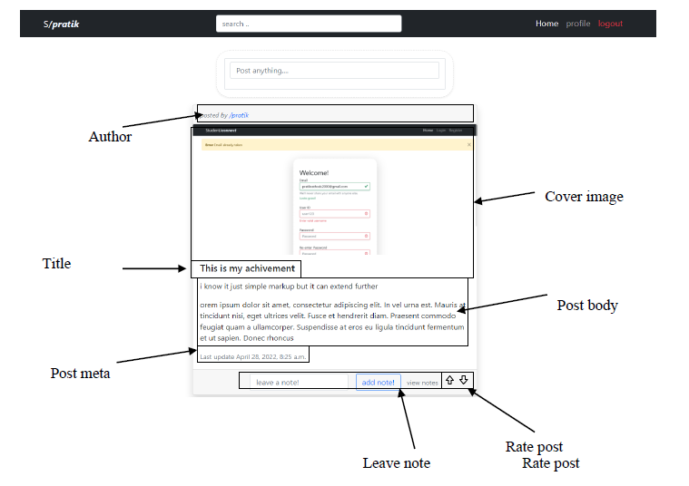
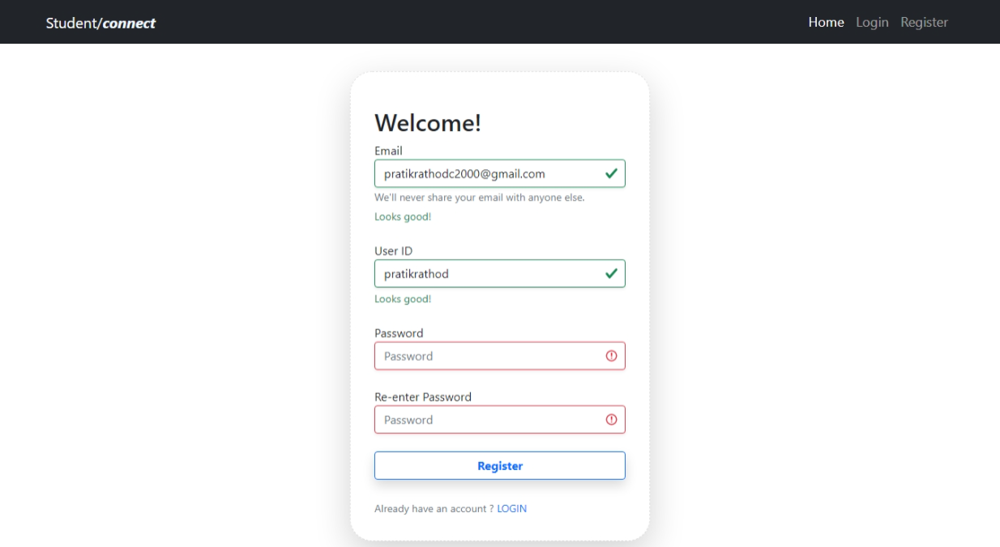
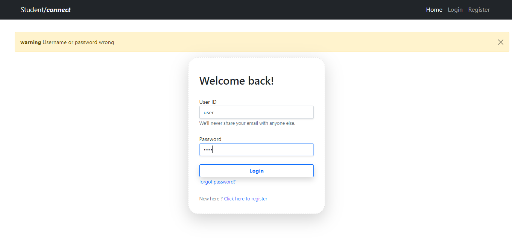
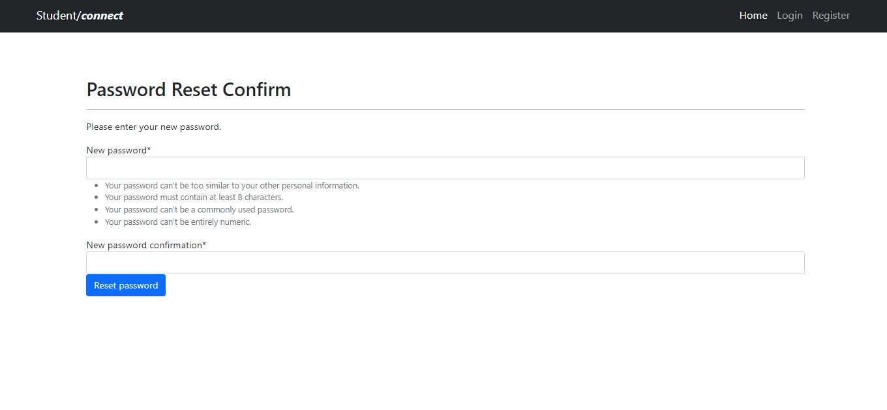
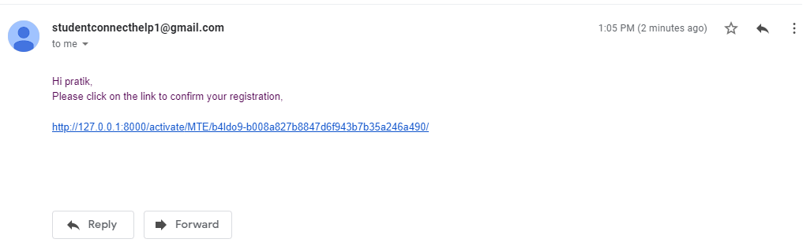
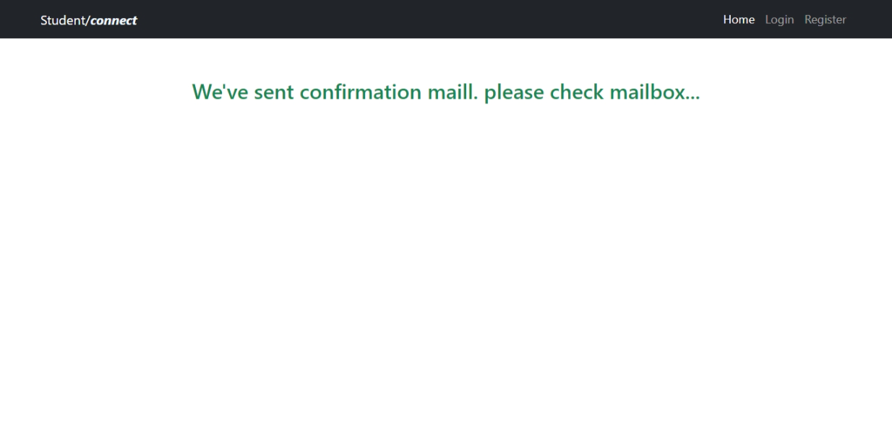

# Student connect
## Introduction

Student Connect is an online platform that connects students from around the world, providing a space for them to share their ideas, achievements, and experiences. Student can create their profile and share their academic/non-academic achivement which inspire other student and facilitating  to grow faster and get insignt in form of likes,comments,followings 
## Methodology
### Research design
This project used a software development methodology that followed the Agile principles. The Agile methodology is a flexible and iterative approach to software development that emphasizes collaboration, continuous feedback, and adaptability.
### Technology:
1. Platform: Web app (Web browsers)
2. Client authoring: CSS, HTML, Bootstrap, JavaScript, Django
3. Server side: Django
4. Server: PostgreSQL
5. Development Tool: Microsoft Visual Studio Code pgAdmin for PostgreSql
6. Extra Tool: Microsoft visio, Microsoft Office, thunder client

### Features

* Register: Allow users to create a new account on the site.
* Login: Allow users to authenticate themselves and access their account.
* Logout: Allow users to log out of the site and end their session.
* Search: Allow users to search for content on the site.
* View: Allow users to view content on the site, such as user profiles, posts, and comments.
* Create: Allow users to create new content on the site, such as posts and comments.
* Edit: Allow users to edit existing content on the site, such as their own posts and comments.
* Delete: Allow users to delete their own content on the site, such as their own posts and comments.
* Follow: Allow users to follow other users and receive updates on their activity.
* Like: Allow users to like and show their approval of content on the site.
* Comment: Allow users to comment on content and engage in discussion with other users.
* Share: Allow users to share content on the site with their social network or other platforms.
* Responsive design: The platform is designed to be mobile-friendly and accessible on a variety of devices, including desktops, laptops, tablets, and smartphones.
* Connect: Allow users to connect with other users and build a network of peers and collaborators.
* Settings: Allow users to customize their account settings, such as their profile information and notification preferences.
* Email authentication: Allow users to verify their email address and confirm their account through email authentication.
* Password reset: Allow users to reset their password through email authentication.
* Security: Implement security measures to protect user data and prevent unauthorized access.
* Privacy: Protect user privacy by handling personal information responsibly and transparently.
* Compliance: Comply with relevant laws and regulations when handling user data.

## Results
### some snapshot of project

## Conclusion
The sole purpose of this project is to develop my skills and seek new challenges.
## References
[boostrap](https://getbootstrap.com/docs/5.3/getting-started/introduction/)
[Django](https://www.djangoproject.com/)
